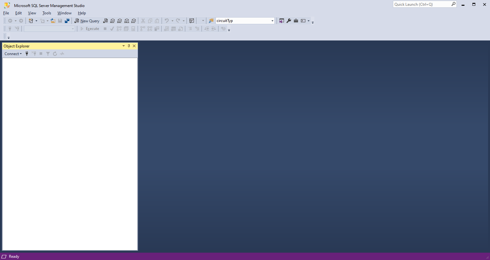
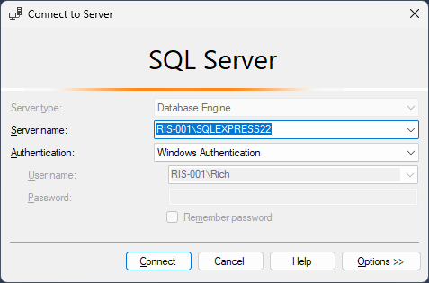
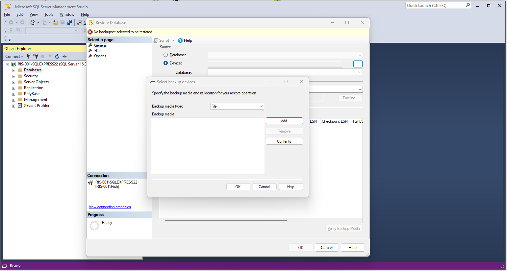
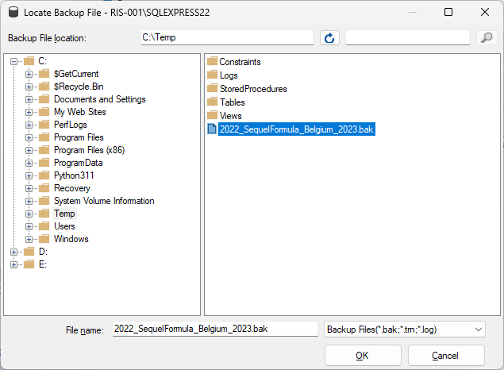

In this section, we will demonstrate how to restore a F1 SQL backup to your instance of Microsoft SQL Server, to begin, make sure that you are running a [supported version](../about/supported-versions). You can of course try and restore to any version of SQL Server, but these are the only versions we officially [support](../about/supported-versions).

We are going to assume you have downloaded the latest release from the link in the [getting started](../getting-started) section of this documentation.

## Step By Step Guide

The below steps will demonstrate how to restore the database backup to your instance of Microsoft SQL Server, if you would rather watch our short video you can do so at the bottom of this page.

### Step 1 - Extract the zip

The first step is to make sure that the zip file that you have downloaded is unpacked. 

### Step 2 - Find the backup for your instance

Next, within that zip locate the **backups** folder and then locate the backup suitable for your instance of SQL Server.

### Step 3 - Open SQL Server Management Studio

Open up Microsoft SQL Server Management Studio.

### Step 4 - Connect to your instance of Microsoft SQL Server

Connect up to your instance by selecting the **connect** button in the **Object Explorer** and selecting **Database Engine** from the list of options.

Enter the details for your instance and click **Connect**. 

Once complete, you should then see something like this. 

### Step 5 - Restore the database backup

Now that you are connected you can begin the restore.

Right click on the **Databases** 'folder' under your instance name and select **Restore Database**.

Select the **Device** Radio Button then click the three `...` to select your file.

Make sure **media file** is selected from the drop down and select **Add**

In the window that appears, navigate to the location of the extracted zip files and select the `.bak` file for your Instance.

You should see something like this

Click the **Files** option on the far left of the window and select **relocate all files to folder** then click **Ok**

You should then get a message to say the Database has been successfully restored.

### Step 6 - Ensure that the backup has been successfully restored. 

If all went well, the database will now be available in Microsoft SQL Management Studio for you to use.

## Video Demonstration

<iframe width="560" height="315" src="https://www.youtube.com/embed/g89yXpLzLhs" title="YouTube video player" frameborder="0" allow="accelerometer; autoplay; clipboard-write; encrypted-media; gyroscope; picture-in-picture; web-share" allowfullscreen></iframe>